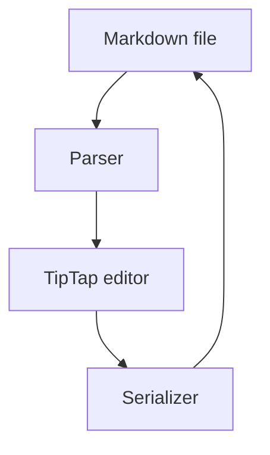

# Requirements Editor — Feature Test Document

This paragraph is soft-wrapped across three lines, exactly like prose in a
real requirements document; edit any word in it, save, and the git diff
should show only this block changed — with the line wraps preserved.

(TRANS_[A-Za-z0-9]+_\d{3})

## 1. Inline formatting

Try selecting text here to get the bubble toolbar: **bold**, *italic*,
`inline code`, ==highlighted==, ~subscript~ like H~2~O, ^superscript^ like
x^2^, <u>underlined</u>, ~~strikethrough~~, and a [link to the repo](https://github.com/akchat0311/md-requirements-vscode).

Raw inline HTML shows as literal source chips BY DESIGN (fidelity-first —
the tags are preserved byte-exact on save, never interpreted): press
<kbd>Cmd</kbd>+<kbd>S</kbd> to save.

A hard break (backslash) follows this line\
and this line continues after it.

> ### TRANS_feat_001 [Draft]
>
>

> ### TRANS_Feature_001 [Draft]

> ### TRANS_feat_003 [Draft]

> ### TRANS_feat_004 [Draft]
>
>

### TRANS_feat_007 [Draft]

## 2. Callouts

> \[!INFO]
>
> This is an info callout. Click inside and type — the styling should hold.

> \[!WARNING]
>
> Warnings render with their own color in both light and dark themes.

> \[!SUCCESS]
>
> Try flipping the VS Code theme while this file is open.

> This is a plain blockquote, not a callout — it must stay a blockquote.

## 3. Math (KaTeX)

Inline math: the identity $e^{i\pi} + 1 = 0$ sits inside a sentence.

### TRANS_feat_008 [Draft]

Another: mass–energy equivalence is $E = mc^2$, and a fraction $\frac{a+b}{c}$.

### TRANS_feat_006 [Draft]

### TRANS_feat_005 [Draft]

### TRANS_feat_009 [*Draft*]

### TRANS_feat_010 [*Draft*]

### TRANS_feat_011 [*Draft*]

## 4. Mermaid diagram



## 5. Code block (plain)

```ts
// Newlines in here are literal content — editing the paragraph above
// must never touch this block.
export function greet(name: string): string {
  return `Hello, ${name}!`;
}
```

## 6. Lists — deliberately non-canonical styles

These use `*` bullets, 3-space nesting, and `1)` numbering on purpose.
Edit something ELSE in this file, save, and `git diff` must show none of
these lines changed:

* first bullet with star marker
   * nested with three-space indent
* second bullet

1) ordered with paren style
2) second item

- canonical bullet list
  - canonical nested item

1. canonical ordered list
2. try pressing Enter at the end of this item to add a third

- [ ] open task item
- [x] completed task item

## 7. Table

(The `<sub>` tags in cells also show as literal chips by design — edit the
table freely; the tags must survive the save unchanged.)

| Requirement | Formula | Status |
| - | - | - |
| REQ_001 | H<sub>2</sub>O purity | draft |
| REQ_002 | line one<br>line two in a cell | approved |
| REQ_003 | plain text | review |

## 8. Slash menu

Put the cursor on the empty line below and type `/` to open the command menu:

rgrgrgrgdf

## 9. Trailing-space preservation

The next line ends with two spaces (an old-style hard break):
line with trailing double space  
and the wrap after it — untouched, these bytes must survive a save.

---

**How to verify the fidelity guarantee:** open this file With → Requirements
Editor, change one word anywhere, hit save, then run `git diff test5.md` —
the diff should contain only the block you edited.
